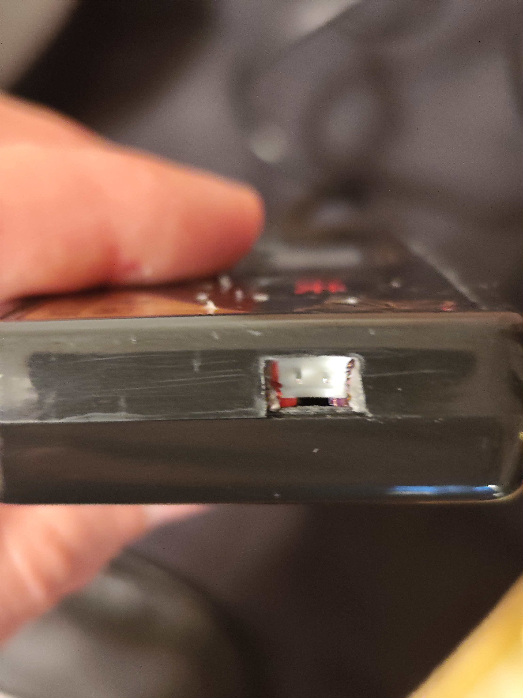
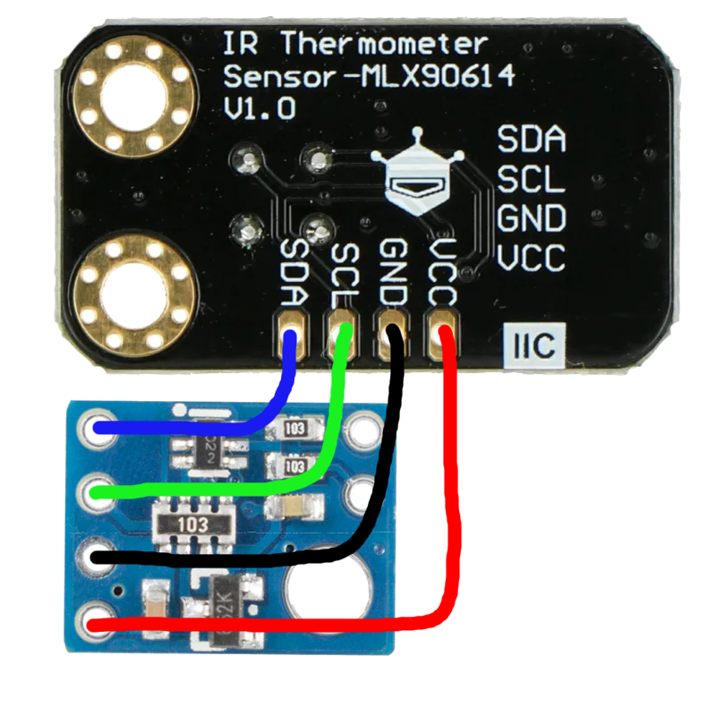

# Induction Cooker

## Prerequisites

### Optocoupler

Optocoupler is required to isolate the high voltage part of the induction cooker from the low voltage ESP32 controller. We recommend using `PC817` optocoupler.
To use the induction cooker with ESP32 we need to modify the hardware slightly. So we open the induction cooker and controller board and connect `PC817` optocoupler pins `emitter` to the one leg of a button and `collector` to the other leg of the button. Then between the `anode` and connector pins of the optocoupler we connect a `150 Ω` resistor in series (I = 20mA at 3.3V).

### Connector

The best connector to use is JST XH 2.54mm 2-pin connector.

### Wiring
An IR thermometer with a laser distance sensor measures the temperature of the teapot's glass surface, while the laser distance sensor detects whether a teapot is present on the induction cooker. Both components are housed in the same 3D printed case. Since they share a single connector, you only need to connect the IR thermometer connector as shown in the wiring diagram below.

