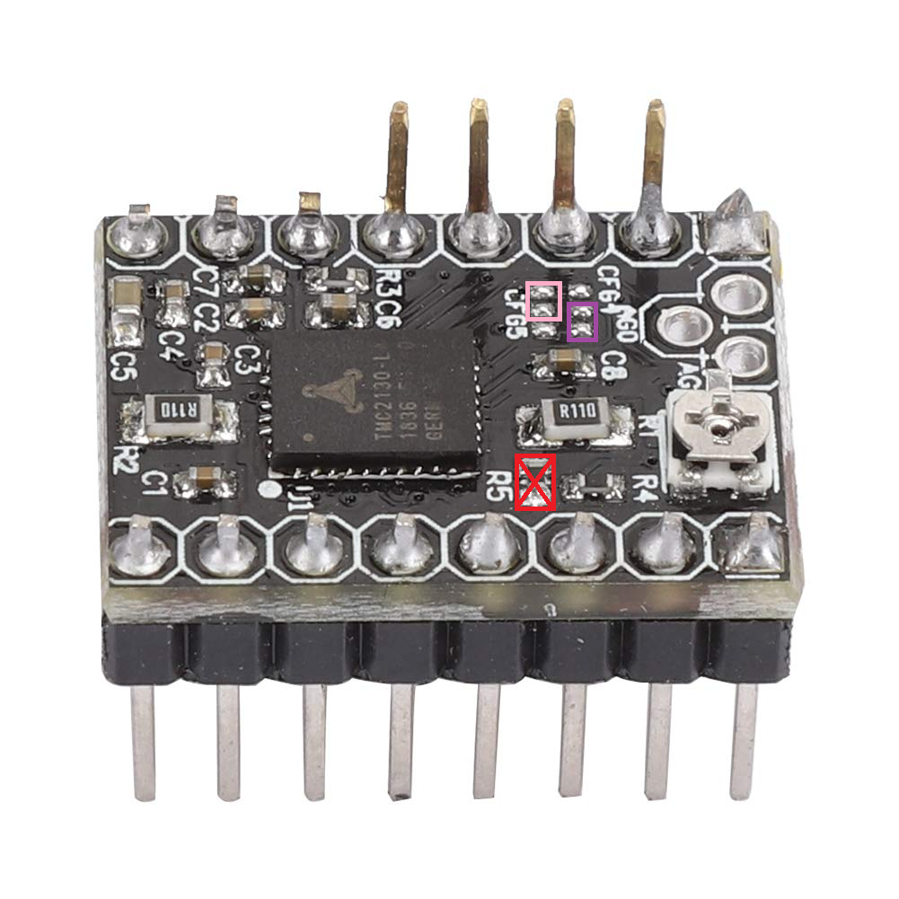
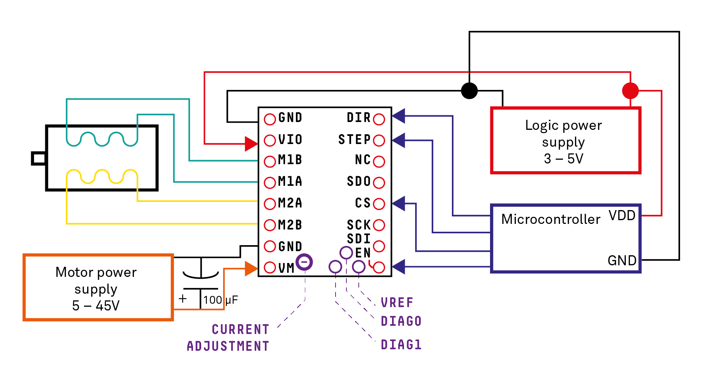

# TMC2130

The TMC2130 is a popular stepper motor driver known for its quiet operation and advanced features. It is widely used in 3D printers, CNC machines, and other applications requiring precise motor control.

## SPI Interface

> [!IMPORTANT]
> Important for proper operation: The TMC2130 V1.1 must be configured to operate in SPI mode. By default, it may be set to a different mode, so the following modifications are necessary.

The TMC2130 communicates via the SPI (Serial Peripheral Interface) protocol. This allows for high-speed data transfer and the ability to configure various parameters of the driver.
To switch the TMC2130 V1.1 into SPI mode:

- unsolder the `R5` resistor on the driver board (red rectangle in the image).
- solder `CFG4` to `GND` (purple rectangle in the image).
- solder `CFG5` to `VIO` (pink rectangle in the image).
  

## Wiring
When using the TMC2130 in SPI mode, the following connections are typically made:
- **GND**: Connect to ground.
- **VIO**: Connect to 3.3V or 5V logic level (depending on your microcontroller).
- **M1A, M1B, M2A, M2B**: Connect to the stepper motor coils.
- **VM**: Connect to the motor power supply (typically 12V or 24V).
- **EN**: Connect to a digital pin on the microcontroller to enable/disable the driver.
- **SDI**: Connect to the microcontroller's MOSI pin.
- **SCK**: Connect to the microcontroller's SCK pin.
- **CS**: Connect to a digital pin on the microcontroller to select the TMC2130.
- **SDO**: Connect to the microcontroller's MISO pin.
- **STEP**: Connect to a digital pin on the microcontroller to control stepping.
- **DIR**: Connect to a digital pin on the microcontroller to control direction.
See the wiring diagram[^1] below for reference:

[^1]: [TMC2130 Arduino Wiring](https://www.julian-h.de/sketch/tmc2130-arduino-wiring/)