# Tea Brewer UI Documentation

## Overview

The Automated Tea Brewer uses **LVGL (Light and Versatile Graphics Library) v9.2.2** for its graphical user interface, designed using **SquareLine Studio 1.5.4**. The UI runs on an ESP32-S3 microcontroller with a round 480x480 display, providing an intuitive touch-based experience for brewing tea.

## Design Features

### Theme System

- **Dynamic Tea Colors**: The UI theme adapts based on the selected tea type, with each tea having its unique color scheme
- **Consistent Styling**: All screens share a common background and typography style using the Montserrat font family
- **Touch Optimized**: Large buttons (100x100 px) ensure easy interaction on the touchscreen

### Tea Types and Colors

The system supports 6 tea types, each with a distinct color:

| Tea Type       | Color Code | Description                                       |
| -------------- | ---------- | ------------------------------------------------- |
| Green Tea      | `#92A202`  | <code style="color: #92A202">Vibrant green</code> |
| Black Tea      | `#CE9958`  | <code style="color: #CE9958">Warm brown</code>    |
| Herbal Tea     | `#E7C789`  | <code style="color: #E7C789">Soft golden</code>   |
| Fruit Tea      | `#D76C6C`  | <code style="color: #D76C6C">Coral red</code>     |
| White Tea      | `#C4BCB5`  | <code style="color: #C4BCB5">Subtle gray</code>   |
| Functional Tea | `#E9D257`  | <code style="color: #E9D257">Bright yellow</code> |

## Screen Descriptions

### 1. Main Screen

The welcome screen displaying the "Automated Tea Brewer" title with the current temperature.

- **Tap Left Side**: Navigate to Settings Screen
- **Tap Right Side**: Navigate to Tea Screen (starts with Green Tea)

### 2. Tea Screen

Displays the currently selected tea type with a themed background image.

- **Begin Button** (Play icon): Navigate to Brew Now or Scheduler Screen
- **Edit Button** (Cookie icon): Navigate to Tea Properties Screen
- **Tap Right Side**: Navigate to next tea (on last tea → Settings Screen)
- **Tap Left Side**: Navigate to previous tea (on first tea → Main Screen)

> **Navigation Loop**: Main Screen → Green Tea → Black Tea → Herbal Tea → Fruit Tea → White Tea → Functional Tea → Settings Screen → Main Screen (circular)

### 3. Tea Properties Screen

Configure brewing parameters for the selected tea:

- **Temperature Roller**: Set brewing temperature (75°C - 100°C in 5°C increments)
- **Infusion Time Rollers**: Set minutes (0-14) and seconds (0-59)
- **Return Button** (Check icon): Save and return to Tea Screen

### 4. Brew Now or Scheduler Screen

Choose between immediate brewing or scheduled brewing:

- **Brew Now Button** (Coffee cup icon): Start brewing immediately
- **Schedule Button** (Clock icon): Navigate to Scheduler Screen
- **Cancel Button** (X icon): Return to Tea Screen

### 5. Teapot Screen

Instructions to place the teapot with water on the designated area.

- Displays a teapot image with placement instructions
- Automatically proceeds when pot is detected

### 6. Brew/Infuse Screen

Active brewing progress display:

- **Progress Arc**: Visual indicator of brewing progress
- **Temperature Display**: Current and target temperature
- **Stop Button** (Stop icon): Cancel brewing and return to Tea Screen

### 7. Scheduler Screen

Configure scheduled brewing:

- **Temperature Roller**: Set target temperature (75°C - 100°C)
- **Time Rollers**: Set hour (0-23) and minute (0-59) for scheduled start
- **Confirm Button** (Check icon): Start scheduled brewing → Navigate to Scheduled Screen
- **Cancel Button** (X icon): Return to Tea Screen

### 8. Scheduled Screen

Displays scheduled brewing information:

- Shows target temperature and scheduled time
- **Cancel Button** (Stop icon): Cancel scheduled brewing and return to Tea Screen

### 9. Settings Screen

Configure system settings:

- **Idle Position Controls**: Adjust the teabag holder idle position (+/- buttons)
- **Tap Left Side**: Navigate to last tea (Functional Tea)
- **Tap Right Side**: Navigate to Main Screen

### 10. Error Screen

Displays error information when issues occur:

- **Error Text Area**: Shows detailed error message
- **Acknowledge Button** (Check icon): Return to Tea Screen

---

## Tea Brewer UI Navigation Map

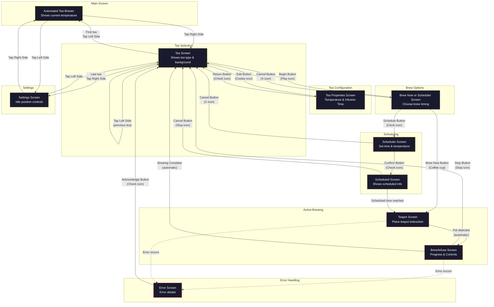

---

## Screen Gallery

| Screen Name                  | Screenshot                                                                |
| ---------------------------- | ------------------------------------------------------------------------- |
| Main Screen                  | 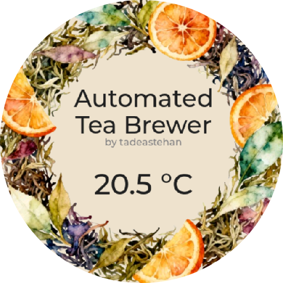                                |
| Tea Screen                   | 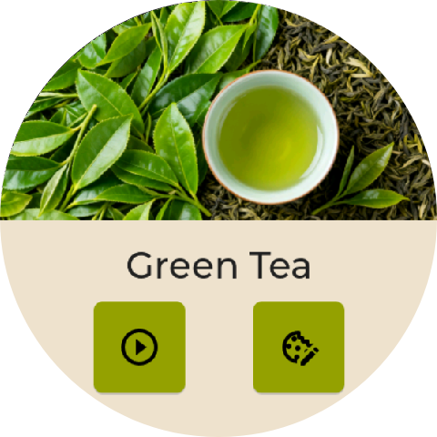                                  |
| Tea Properties Screen        | 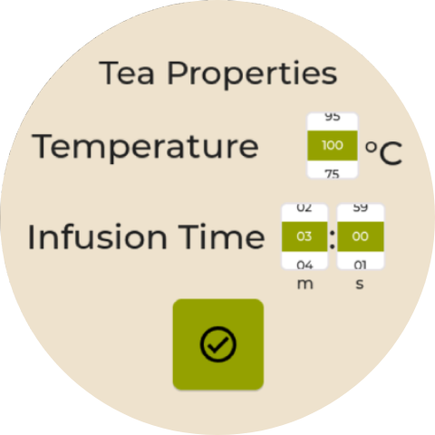             |
| Brew Now or Scheduler Screen | 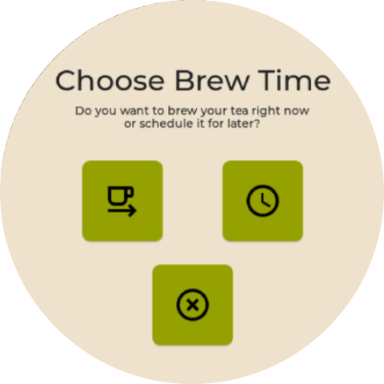 |
| Teapot Screen                | 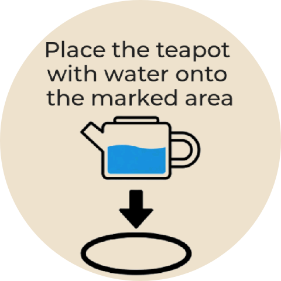                            |
| Brew/Infuse Screen           | 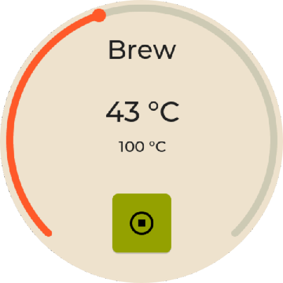                   |
| Scheduler Screen             | 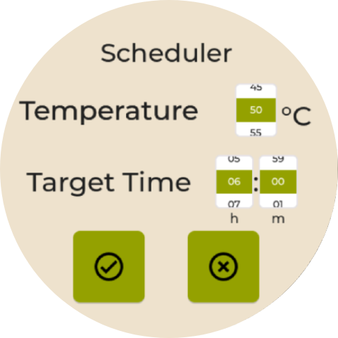                      |
| Scheduled Screen             | 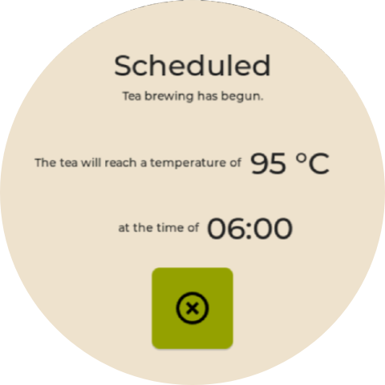                      |
| Error Screen                 | 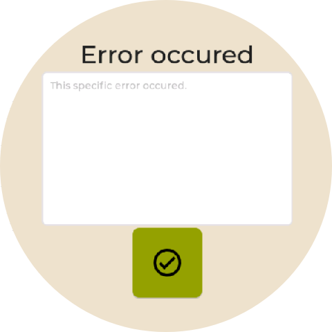                              |
| Tea Theme Colors             | 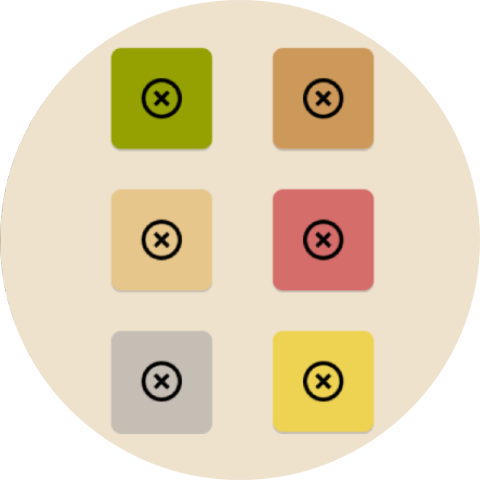                       |

---

## Technical Details

### Screen IDs

```c
#define UI_SCREEN_MAIN              0
#define UI_SCREEN_TEA               1
#define UI_SCREEN_TEAPOT            2
#define UI_SCREEN_BREW_INFUSE       3
#define UI_SCREEN_ERROR             4
#define UI_SCREEN_TEA_PROPERTIES    5
#define UI_SCREEN_BREW_NOW_OR_SCHEDULER 6
#define UI_SCREEN_SETTINGS          7
#define UI_SCREEN_SCHEDULER         8
#define UI_SCREEN_SCHEDULED         9
```

### File Structure

```
src/tea-brewer/main/ui/
├── ui.c / ui.h              # Main UI initialization
├── ui_events.c / ui_events.h # Event handlers
├── ui_helpers.c / ui_helpers.h # Helper functions
├── ui_themes.c / ui_themes.h # Theme definitions
├── screens/                  # Individual screen files
│   ├── ui_MainScreen.c/h
│   ├── ui_TeaScreen.c/h
│   ├── ui_TeaPropertiesScreen.c/h
│   ├── ui_BrewNowOrSchedulerScreen.c/h
│   ├── ui_TeapotScreen.c/h
│   ├── ui_BrewInfuseScreen.c/h
│   ├── ui_SchedulerScreen.c/h
│   ├── ui_ScheduledScreen.c/h
│   ├── ui_SettingsScreen.c/h
│   └── ui_ErrorScreen.c/h
├── fonts/                    # Font assets
└── images/                   # Image assets
```

### SquareLine Studio Project

The UI design source files are located in:

```
src/ui/SquareLine-Project/
├── Automated-Tea-Brewer.spj  # Main project file
├── Automated-Tea-Brewer.sll  # Layout file
├── Themes.slt                # Theme definitions
└── assets/                   # Design assets
```
